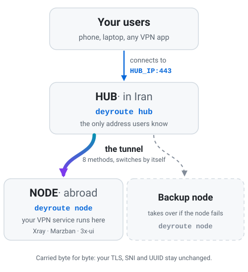

<div align="center">


### A tunnel between your Iran server and your foreign servers that is simple to run, hard to spot, and repairs itself when filtering changes.

[فارسی](README.md) · **English**

[Quick start](#quick-start-5-minutes) ·
[Everyday use](#everyday-use) ·
[How it survives filtering](#how-it-survives-filtering) ·
[Troubleshooting](#something-is-wrong) ·
[Full guides](docs/en/index.md)

</div>

---

## What is DEYROUTE?

DEYROUTE connects two kinds of servers:

- the **hub**: your server **in Iran**. Your users connect to it, and only to it.
- the **nodes**: your servers **abroad**. They run your real VPN service (Xray, Marzban, 3x-ui, and so on).

<p align="center">
  <picture>
    <source media="(prefers-color-scheme: dark)" srcset="docs/assets/how-it-works-en-dark.svg">
    
  </picture>
</p>

Your users only need the hub's address, so the foreign server's address stays out
of their configs. Their traffic travels through the tunnel exactly as it left
their device: DEYROUTE does not open, change, or re-encrypt it.

## Why people like it

| | |
| --- | --- |
| **Three steps, copy and paste** | Install on the hub, paste one command on the node, create the tunnel. Every question has a suggested answer: press <kbd>Enter</kbd> to take it. |
| **Hard to identify** | Eight tunnel methods from six different programs, some made to look like ordinary HTTPS to a real website. When one is recognised and blocked, the next one starts. |
| **It fixes itself** | The hub checks every tunnel every 5 seconds. A blocked method is replaced automatically (goal: under 35 seconds; about 20 in our lab tests), with nobody awake. When the first method has been healthy again for a few minutes, the tunnel goes back to it. |
| **Backup nodes** | Add a second foreign server that runs the same VPN service (same users and settings), and the tunnel moves to it if the first one goes down. |
| **Your service stays as it is** | Same port, same certificate, same UUID. In your client configs only the server address changes, to the hub's IP. |
| **Errors you can read** | Every problem says what happened, why, and what to do, with a fixed code such as `DEY-P012`. |
| **Private by design** | One signed program, no telemetry, no secrets in logs, and exactly one firewall table that DEYROUTE owns. |

## Quick start (5 minutes)

**You need:**

- **Two servers** with Ubuntu 22.04 / 24.04 / 26.04 or Debian 12 / 13 (amd64 or arm64): the **hub** in Iran, and the **node** abroad, which already runs your VPN service (3x-ui, Marzban, Xray ...). Check that the service works from a phone first.
- **`root`** on both (`ssh root@SERVER_IP`, or `sudo -i` after logging in as another user), and `curl` (`apt-get install -y curl`). No Python, no Docker. Each command below goes on the server named in its heading.
- **GitHub reachable from the hub.** Iranian datacenters often block it; if step 1 cannot download, see [installing without GitHub](docs/en/install.md#when-github-is-not-reachable-from-the-hub).
- **Open ports in your provider's firewall panel** (and in `ufw`, if you use it), or the steps below fail without a message. Hub: `44433/tcp` (nodes join here), your tunnel port such as `443` (your users), and `30000-31999` TCP and UDP from the node's IP. Node: `30000-31999` TCP and UDP from the hub's IP.

### 1. On the hub (Iran server)

```bash
bash <(curl -fsSL https://github.com/localroot4/DeyRoute/releases/latest/download/install.sh)
```

A short wizard asks at most five questions, one per screen. Type `1` for the role (hub),
give the server a name such as `ir-1`, and press <kbd>Enter</kbd> for the rest.
At the end it prints a **join command**. Copy that whole line.

### 2. On the node (foreign server)

Paste the whole join command and add `--name de-1` at its very end: that is the node's
**id**, the short name later commands use. The command works once and expires in 15 minutes:

```bash
bash <(curl -fsSL https://github.com/localroot4/DeyRoute/releases/latest/download/install.sh) join 'dey://…' --name de-1
```

The command the hub prints may already end with `--version …`; keep that part and put
`--name de-1` after it.

About 30 seconds later, go back to the **hub**. The node must be listed as `online`:

```bash
deyroute node list
```

Not listed? The usual cause is `44433/tcp` closed in the hub's provider firewall. Open it, then run `deyroute node join-command` on the hub for a new command.

### 3. On the hub: create the tunnel

Use the node id from `deyroute node list` and the port your VPN service listens on
(it must be free on the hub; `deyroute port suggest` lists free ones). `main` is
the tunnel's id, used by the commands below:

```bash
deyroute tunnel add --node de-1 --ports 443 --name main
```

You will see the steps go by, ending with a line like:

```text
✔ Tunnel main is UP via backhaul/wssmux (41ms)
```

### 4. Check it, then change the address in your clients

```bash
deyroute status
deyroute port check 443
```

In your client app (or panel) replace the node's address with the **hub's IP**. Keep
everything else (port, UUID or password, SNI, path) exactly as it was. Then test from a
phone **inside Iran**: `deyroute port check` only proves the port is open from the
internet, it cannot see filtering in Iran.

**Recommended next step:** add a second foreign server the same way (it must run
the same VPN service), then make it the backup:
`deyroute tunnel backup add main --node nl-1`.

## Everyday use

Type `deyroute` (or just `dey`) to open the menu. Press a number, then
<kbd>Enter</kbd>. <kbd>q</kbd> goes back and <kbd>?</kbd> explains the screen you are on.

```text
 1) Dashboard       4) Ports           7) Optimize         10) Backup & Restore
 2) Tunnels         5) Failover        8) Security         11) Update
 3) Nodes           6) Diagnostics     9) Notifications    12) Settings
```

Everything in the menu is also a command, handy for scripts (add `--json`):

| I want to… | Run |
| --- | --- |
| see everything at a glance | `deyroute status` |
| add a foreign server | `deyroute node join-command` (on the hub), then paste the command on the new server |
| create a tunnel | `deyroute tunnel add --node de-1 --ports 443,2053` |
| add or remove a port | `deyroute port add main 8443` / `deyroute port remove main 8443` |
| check that a port really works | `deyroute port check 443` |
| watch the logs | `deyroute logs main -f` |
| switch method or node by hand | `deyroute tunnel switch main --transport backhaul/tcpmux` |
| add a backup node | `deyroute tunnel backup add main --node nl-1` |
| test every method and compare latency (**interrupts the tunnel**, 20 s per method) | `deyroute tunnel test-ladder main` |
| get Telegram alerts | menu `9) Notifications` |
| collect a report for support | `deyroute doctor` (secrets are removed) |

New to it? Stay in **Simple mode**: it hides everything advanced, and the tunnel wizard asks
at most three questions (node, ports, confirm). Switch in `12) Settings → 1) UI mode` when you want more.

## How it survives filtering

Filtering keeps changing, so one method is never enough. Every tunnel gets a
**ladder** of methods from different programs. One rung carries the traffic; the
others are installed, configured and waiting.

| Rung | Method | Why it is there |
| :-: | --- | --- |
| 1 | `backhaul/wssmux` | TLS and WebSocket in few connections: looks like normal HTTPS |
| 2 | `backhaul/tcpmux` | no TLS layer, least overhead, for when the tunnel's TLS is what gets noticed |
| 3 | `rathole/noise` | a different program and protocol with Noise encryption |
| 4 | `frp/tcp` | a third program with a different traffic pattern |
| 5 | `xray/reality` | looks like a real TLS 1.3 visit to a harmless website |
| 6 | `hysteria2/udp` | QUIC: fastest on lossy links, when UDP is open |
| 7 | `waterwall/reverse-reality` | a reverse connection that also looks like a real website (least tested method) |
| 8 | `direct/native` | no disguise; only so the service does not go down |

When the hub confirms that the active rung is blocked, it starts the next one;
users usually do not notice. When rung 1 has been healthy again for a few minutes,
the tunnel goes back to it. The built-in ladder cannot be edited, but you can build
your own: `deyroute ladder create NAME --rungs a,b,c`, then
`deyroute tunnel edit main --ladder NAME`. Details: [the filtering FAQ](docs/en/faq-filtering.md).

**Good habits that make you harder to spot**

- Give users only the hub's address. Never publish the foreign server's IP.
- Keep your service's own TLS settings (Reality, WebSocket, and so on). DEYROUTE does not replace them, it carries them.
- Optional: choose three decoy sites for the Reality rungs (real HTTPS sites with TLS 1.3, open from your hub and not blocked in Iran). Run `deyroute config edit` and under `hub:` set `decoy_snis: [site1.com, site2.com, site3.com]`.
- Keep a backup node in another provider or country.
- No tool can promise to be invisible. DEYROUTE's job is to make recognising and blocking you expensive, and to recover quickly when it happens.

## Keeping it safe

- The **control channel** always goes from the foreign servers **out** to the hub, over mutual TLS 1.3 with a private CA. The hub never logs in to a node, and SSH is not used.
- The join command works **once** and expires in 15 minutes.
- DEYROUTE creates and manages exactly one firewall table (`inet deyroute`) and never touches your other rules.
- Every release is signed; the installer verifies the signature and checksums before installing.
- No telemetry. Secrets are stored with mode `0600` and never written to logs.

More: [security guide](docs/en/security.md).

## Update, back up, move, remove

```bash
bash <(curl -fsSL https://github.com/localroot4/DeyRoute/releases/latest/download/install.sh)   # same line = repair or upgrade
deyroute update                      # update deyroute itself; tunnels keep running
deyroute update backends             # update the tunnel programs (Backhaul, Xray, ...)
deyroute backup                      # encrypted backup of the hub (asks for a passphrase)
deyroute restore FILE                # on the new server, after install.sh --no-setup
deyroute hub announce-move NEW_IP:44433  # on the old hub: tell every online node
deyroute node set-hub NEW_IP:44433   # or on each node, by hand
deyroute uninstall                   # remove everything and restore the system
```

Run these on the hub unless a comment says otherwise.

Guides: [update and uninstall](docs/en/update-uninstall.md) ·
[backup and restore](docs/en/backup.md) · [moving the hub](docs/en/hub-move.md).

## Something is wrong?

Start with `deyroute doctor`. It checks the system, ports, certificates, units and
logs, and explains each finding in plain words.

| Symptom | Try |
| --- | --- |
| a node is `offline` | on the hub: `deyroute node test <id>`, then open `44433/tcp` in the hub's provider firewall |
| the tunnel is `UP` but the client cannot connect | on the hub: `deyroute port check <port>` (it prints the command that opens a closed port). Also check that your VPN service runs on the node |
| the tunnel keeps switching methods | `deyroute logs <tunnel>`; then, when a short interruption is acceptable, `deyroute tunnel test-ladder <tunnel>` |
| an error with a code | read its three lines (what / why / fix); all codes are in [docs/ERRORS.md](docs/ERRORS.md) |

More: [troubleshooting](docs/en/troubleshooting.md).

## Good to know

- **Hub and node are the same program.** The role is chosen in the wizard.
- **Your TLS is never touched.** The tunnel carries raw bytes, so your client keeps its SNI, path, UUID and fingerprint.
- **Honest limits.** The node must reach the hub's control port (`44433/tcp`); a few methods (Reality, Hysteria2, direct) also connect from the hub to the node. If the route between the two countries is cut completely, the tunnel stays down until it returns: DEYROUTE cannot work around that today, so please open an issue. Your VPN panel sees the hub's address, not your users' real IPs, so per-IP limits there will not work.
- **Early builds.** Releases are currently `edge` builds. They pass automated lab tests (systemd, nftables and the real backends in containers) but have had little real-world testing; see what is still pending in the [acceptance evidence](docs/en/acceptance.md). Running the install line again upgrades in place and keeps your configuration.

## Documentation

| Guide | |
| --- | --- |
| [Install](docs/en/install.md) | requirements, offline install, mirrors, what the installer verifies |
| [Join a node](docs/en/join.md) | the join command, expiry, IP changes |
| [First tunnel](docs/en/first-tunnel.md) | the menu and the CLI, port syntax, health probes |
| [Backup node](docs/en/backup-node.md) | failover, failback, timings |
| [Filtering FAQ](docs/en/faq-filtering.md) | the ladder, skipped methods, decoy sites |
| [Troubleshooting](docs/en/troubleshooting.md) | doctor, logs, common codes |
| [Security](docs/en/security.md) | control channel, tokens, firewall, rotation |
| Reference | [error codes](docs/ERRORS.md) · [`--json` output](docs/cli-json.md) · [backends](docs/backends/) |
| Project | [architecture](docs/dev/ARCHITECTURE.md) · [releasing](docs/dev/RELEASING.md) · [decisions and open questions](QUESTIONS.md) · [changelog](CHANGELOG.md) |

## Build from source

```bash
make build        # static binary in ./dist (CGO_ENABLED=0)
make test lint    # unit tests and linters
```

Integration scenarios run in systemd containers: `test/integration/run.sh`
(see the header of the script). Issues and pull requests are welcome.
