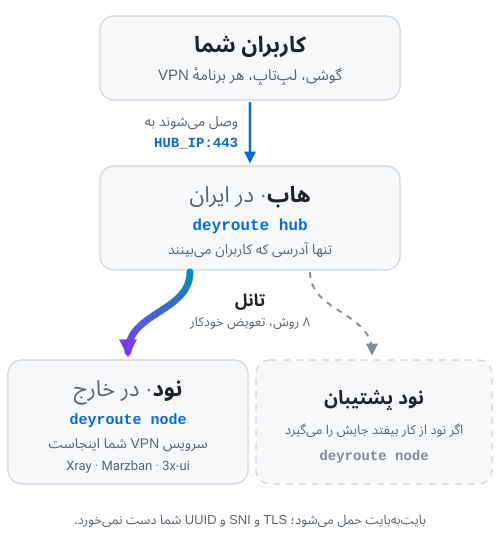
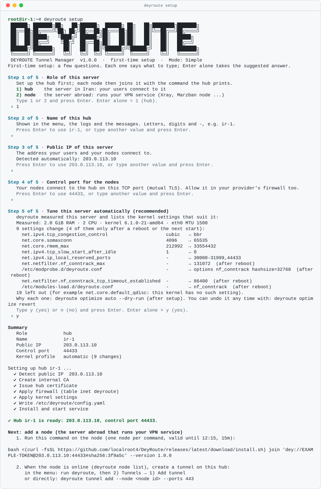
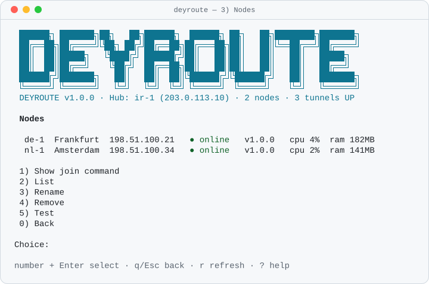
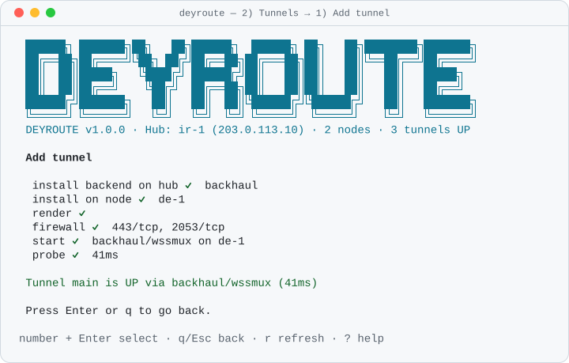
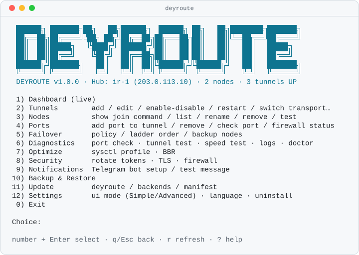
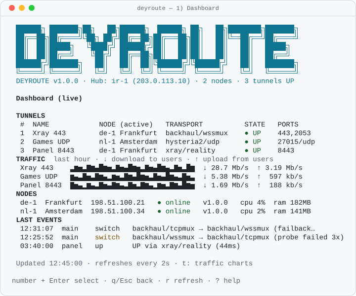
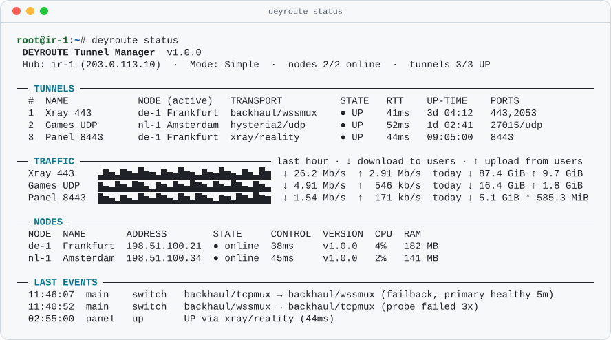
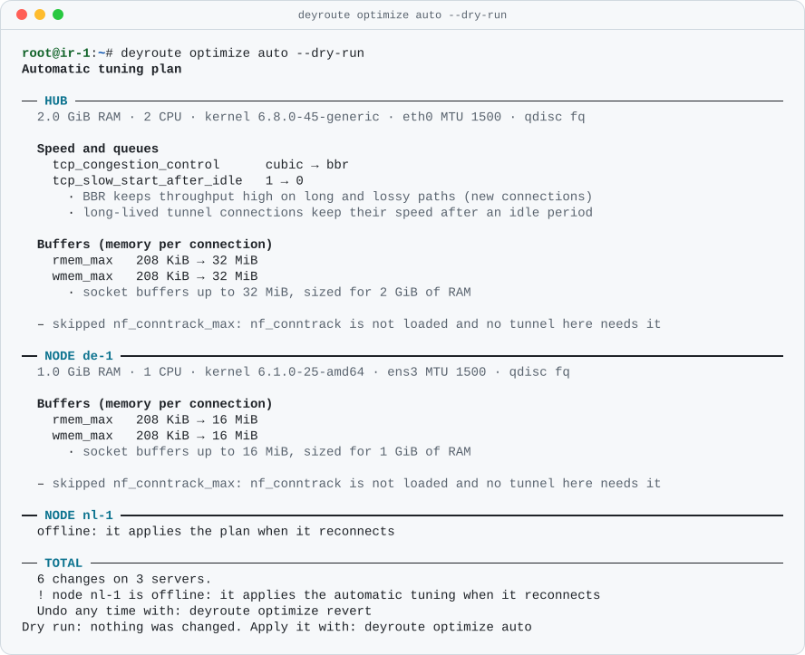
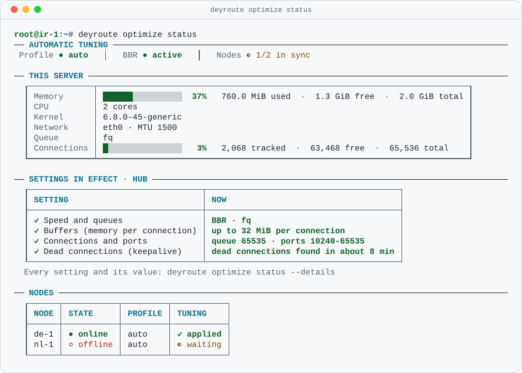
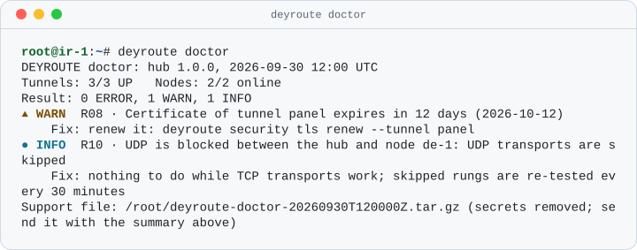

<div align="center">


<div dir="rtl">

### تانلی بین سرور ایران و سرورهای خارج: راه‌اندازی ساده، شناسایی سخت، و ترمیم خودکار وقتی فیلترینگ عوض می‌شود.

**فارسی** · [English](README.en.md)

<p>
<a href="https://github.com/localroot4/DeyRoute/releases/latest"></a>
<a href="https://github.com/localroot4/DeyRoute/actions/workflows/ci.yml"></a>
<a href="https://github.com/localroot4/DeyRoute/releases"></a>
<a href="https://github.com/localroot4/DeyRoute/stargazers"></a>

</p>

اگر DEYROUTE به کارتان آمد، با یک ⭐ کمک کنید دیگران هم پیدایش کنند.

[شروع سریع](#شروع-سریع-۵-دقیقه) ·
[کار روزمره](#کار-روزمره) ·
[پایش ترافیک](#پایش-ترافیک) ·
[مقابله با فیلترینگ](#مقابله-با-فیلترینگ) ·
[عیب‌یابی](#مشکلی-پیش-آمده) ·
[راهنماهای کامل](docs/fa/index.md)

</div>

</div>

---

<div dir="rtl">

## DEYROUTE چیست؟

یک مدیر تانل (تونل) کامل برای اتصال سرور ایران به سرور خارج: به‌جای اینکه Backhaul، Rathole، FRP، Xray Reality، Hysteria2 یا Waterwall را دستی و جدا جدا راه بیندازید و هر بار که فیلتر شد دستی عوضش کنید، DEYROUTE همه را با یک دستور نصب می‌کند، سالم بودنشان را مدام آزمایش می‌کند و وقتی یکی بسته شد، خودکار سراغ بعدی می‌رود.

DEYROUTE دو نوع سرور را به هم وصل می‌کند:

- **هاب (Hub):** سرور شما **در ایران**. کاربرانتان فقط به همین وصل می‌شوند.
- **نود (Node):** سرور یا سرورهای شما **در خارج**. سرویس واقعی VPN شما (Xray، Marzban، 3x-ui و مانند آن) روی آن‌هاست.

</div>

<p align="center">
  <picture>
    <source media="(prefers-color-scheme: dark)" srcset="docs/assets/how-it-works-fa-dark.svg">
    
  </picture>
</p>

<div dir="rtl">

کاربران فقط به آدرس هاب نیاز دارند، پس آدرس سرور خارج در تنظیمات آن‌ها نمی‌آید. ترافیک آن‌ها دقیقاً به همان شکلی که از دستگاهشان
بیرون آمده، از تانل عبور می‌کند: DEYROUTE آن را باز نمی‌کند، تغییر نمی‌دهد و دوباره رمزگذاری نمی‌کند.

## چرا DEYROUTE؟

| | |
| --- | --- |
| **سه قدم، فقط کپی و پیست** | روی هاب نصب کنید، یک دستور را روی نود بچسبانید، تانل را بسازید. هر سؤال یک جواب پیشنهادی دارد: برای قبولش فقط <kbd>Enter</kbd> بزنید. |
| **شناسایی‌اش سخت است** | هشت روش تانل از شش برنامهٔ مختلف، که بعضی‌شان طوری ساخته شده‌اند که شبیه HTTPS معمولی به یک سایت واقعی باشند. وقتی یکی شناسایی و بسته شود، بعدی شروع می‌شود. |
| **خودش را درست می‌کند** | هاب هر تانل را هر ۵ ثانیه آزمایش می‌کند. روش بسته‌شده خودکار عوض می‌شود (هدف: کمتر از ۳۵ ثانیه؛ در آزمایش‌های آزمایشگاهی ما حدود ۲۰ ثانیه)، حتی وقتی هیچ‌کس بیدار نیست. وقتی روش اول دوباره چند دقیقه سالم بماند، تانل به آن برمی‌گردد. |
| **نود پشتیبان** | یک سرور خارج دیگر اضافه کنید که همان سرویس VPN را اجرا می‌کند (با همان کاربران و تنظیمات)؛ اگر اولی از کار بیفتد، تانل خودش به آن می‌رود. |
| **سرویس شما همان‌طور می‌ماند** | همان پورت، همان گواهی، همان UUID. در تنظیمات کلاینت فقط آدرس سرور عوض می‌شود، به IP هاب. |
| **خطاهایی که می‌شود خواند** | هر مشکل می‌گوید چه شد، چرا شد و چه کنید، با یک کد ثابت مثل `DEY-P012`. |
| **طراحی‌شده برای حریم خصوصی** | یک برنامهٔ امضاشده، بدون ارسال هیچ آماری، بدون ثبت اطلاعات حساس در لاگ‌ها، و فقط جدول‌های فایروال خودش. |

## شروع سریع (۵ دقیقه)

**چه چیزهایی لازم است:**

- **دو سرور** با Ubuntu 22.04 / 24.04 / 26.04 یا Debian 12 / 13 (معماری amd64 یا arm64): **هاب** در ایران، و **نود** در خارج که سرویس VPN شما (3x-ui، Marzban، Xray و ...) از قبل روی آن کار می‌کند. اول مطمئن شوید این سرویس با گوشی کار می‌کند.
- **دسترسی `root`** روی هر دو (`ssh root@SERVER_IP`، یا بعد از ورود با کاربر دیگر `sudo -i`) و `curl` (`apt-get install -y curl`). نه Python لازم است، نه Docker. هر دستور زیر روی سروری است که در عنوان همان بخش آمده.
- **دسترسی هاب به GitHub.** دیتاسنترهای ایران اغلب آن را می‌بندند؛ اگر مرحلهٔ ۱ دانلود نکرد، [نصب بدون GitHub](docs/fa/install.md#وقتی-سرور-ایران-به-github-دسترسی-ندارد) را ببینید.
- **پورت‌های باز در پنل فایروال ارائه‌دهندهٔ سرور** (و در `ufw`، اگر استفاده می‌کنید)، وگرنه مرحله‌های بعد بی‌هیچ پیامی شکست می‌خورند. هاب: `44433/tcp` (نودها اینجا join می‌شوند)، پورت تانل مثل `443` (کاربران شما)، و `30000-31999` برای TCP و UDP از IP نود. نود: `30000-31999` برای TCP و UDP از IP هاب.

### ۱. روی هاب (سرور ایران)

</div>

```bash
bash <(curl -fsSL https://github.com/localroot4/DeyRoute/releases/latest/download/install.sh)
```

<div dir="rtl">

یک ویزارد کوتاه حداکثر پنج سؤال می‌پرسد، هر سؤال در یک صفحه. برای نقش، `1` (هاب) را بزنید،
یک اسم مثل `ir-1` بدهید و برای بقیه فقط <kbd>Enter</kbd> بزنید. در پایان یک **دستور join**
چاپ می‌شود. آن را کامل و یک‌جا کپی کنید.

تصویرهای این صفحه از خود برنامه گرفته شده‌اند؛ صفحه‌ها و پیام‌های برنامه به انگلیسی است.

</div>

<p align="center">
  <picture>
    <source media="(prefers-color-scheme: dark)" srcset="docs/assets/screens/cli-setup-dark.svg">
    
  </picture>
</p>

<div dir="rtl">

### ۲. روی نود (سرور خارج)

دستور join را کامل بچسبانید و در انتهای آن `--name de-1` را اضافه کنید: این **شناسهٔ** نود است،
همان اسم کوتاهی که دستورهای بعدی به کار می‌برند. دستور فقط یک‌بار کار می‌کند و ۱۵ دقیقه اعتبار دارد:

</div>

```bash
bash <(curl -fsSL https://github.com/localroot4/DeyRoute/releases/latest/download/install.sh) join 'dey://…' --name de-1
```

<div dir="rtl">

دستوری که هاب چاپ می‌کند ممکن است از قبل با `--version …` تمام شود؛ آن بخش را نگه دارید و
`--name de-1` را بعد از آن بگذارید.

حدود ۳۰ ثانیه بعد به **هاب** برگردید. نود باید با وضعیت `online` در فهرست دیده شود:

</div>

```bash
deyroute node list
```

<div dir="rtl">

منو همین فهرست را در `3) Nodes` نشان می‌دهد:

</div>

<p align="center">
  <picture>
    <source media="(prefers-color-scheme: dark)" srcset="docs/assets/screens/tui-nodes-dark.svg">
    
  </picture>
</p>

<div dir="rtl">

دیده نشد؟ معمولاً علت این است که `44433/tcp` در فایروال ارائه‌دهندهٔ سرورِ هاب بسته است. آن را باز کنید و روی هاب با `deyroute node join-command` دستور جدید بگیرید.

### ۳. روی هاب: تانل را بسازید

شناسهٔ نود را از `deyroute node list` بردارید و پورتی را بنویسید که سرویس VPN شما روی آن گوش می‌دهد
(باید روی هاب آزاد باشد؛ `deyroute port suggest` پورت‌های آزاد را نشان می‌دهد). `main` شناسهٔ تانل است
و دستورهای زیر آن را به کار می‌برند:

</div>

```bash
deyroute tunnel add --node de-1 --ports 443 --name main
```

<div dir="rtl">

مرحله‌ها را می‌بینید که رد می‌شوند و آخرش خطی مثل این می‌آید:

</div>

```text
✔ Tunnel main is UP via backhaul/wssmux (41ms)
```

<div dir="rtl">

منو همین کار را در `2) Tunnels → 1) Add tunnel` انجام می‌دهد (نود، پورت‌ها، تأیید):

</div>

<p align="center">
  <picture>
    <source media="(prefers-color-scheme: dark)" srcset="docs/assets/screens/tui-add-tunnel-done-dark.svg">
    
  </picture>
</p>

<div dir="rtl">

### ۴. بررسی کنید، بعد آدرس را در کلاینت‌ها عوض کنید

</div>

```bash
deyroute status
deyroute port check 443
```

<div dir="rtl">

در برنامهٔ کلاینت (یا پنل) آدرس نود را با **IP هاب** عوض کنید. همهٔ چیزهای دیگر (پورت،
UUID یا رمز، SNI، مسیر) را دقیقاً مثل قبل نگه دارید. بعد با یک گوشی **داخل ایران** امتحان کنید:
`deyroute port check` فقط نشان می‌دهد پورت از اینترنت باز است و فیلترینگ داخل ایران را نمی‌بیند.

**پیشنهاد ما برای قدم بعد:** یک سرور خارج دیگر هم به همین روش اضافه کنید (باید همان
سرویس VPN روی آن اجرا شود) و آن را نود پشتیبان کنید:
`deyroute tunnel backup add main --node nl-1`

## کار روزمره

با زدن `deyroute` (یا فقط `dey`) منو باز می‌شود. یک شماره بزنید و <kbd>Enter</kbd> را بزنید.
با <kbd>q</kbd> یک صفحه به عقب برمی‌گردید و <kbd>?</kbd> صفحه‌ای را که در آن هستید توضیح می‌دهد.

</div>

<p align="center">
  <picture>
    <source media="(prefers-color-scheme: dark)" srcset="docs/assets/screens/tui-main-menu-dark.svg">
    
  </picture>
</p>

<div dir="rtl">

`1) Dashboard` همهٔ تانل‌ها، نودها و رویدادهای اخیر را نشان می‌دهد و هر ۲ ثانیه به‌روز می‌شود:

</div>

<p align="center">
  <picture>
    <source media="(prefers-color-scheme: dark)" srcset="docs/assets/screens/tui-dashboard-dark.svg">
    
  </picture>
</p>

<div dir="rtl">

همین صفحه بدون منو، با `deyroute status` (در ترمینال باریک موبایل هم مرتب می‌ماند):

</div>

<p align="center">
  <picture>
    <source media="(prefers-color-scheme: dark)" srcset="docs/assets/screens/cli-status-dark.svg">
    
  </picture>
</p>

<div dir="rtl">

هر کاری که در منو می‌شود با یک دستور هم می‌شود؛ برای اسکریپت‌ها هم مناسب است (با `--json`):

| می‌خواهم… | این را بزنم |
| --- | --- |
| همه‌چیز را یک‌جا ببینم | `deyroute status` |
| یک سرور خارج اضافه کنم | `deyroute node join-command` (روی هاب)، بعد دستور را روی سرور جدید بچسبانم |
| تانل بسازم | `deyroute tunnel add --node de-1 --ports 443,2053` |
| پورت اضافه یا حذف کنم | `deyroute port add main 8443` / `deyroute port remove main 8443` |
| ببینم پورت واقعاً کار می‌کند | `deyroute port check 443` |
| لاگ را زنده ببینم | `deyroute logs main -f` |
| روش یا نود را دستی عوض کنم | `deyroute tunnel switch main --transport backhaul/tcpmux` |
| نود پشتیبان اضافه کنم | `deyroute tunnel backup add main --node nl-1` |
| همهٔ روش‌ها را آزمایش و تأخیرشان را مقایسه کنم (**تانل را قطع می‌کند**؛ هر روش ۲۰ ثانیه) | `deyroute tunnel test-ladder main` |
| هشدار در تلگرام بگیرم | منوی `9) Notifications` |
| گزارش برای پشتیبانی بگیرم | `deyroute doctor` (اطلاعات حساس حذف می‌شوند) |

تازه‌کارید؟ در **حالت Simple** بمانید: همهٔ بخش‌های پیشرفته را پنهان می‌کند و ویزارد ساخت تانل
حداکثر سه سؤال می‌پرسد (نود، پورت‌ها، تأیید). هر وقت بیشتر خواستید، از منوی `12) Settings` گزینهٔ `1) UI mode` را عوض کنید.

## پایش ترافیک

هاب بایت‌های هر تانل را می‌شمارد و CPU و RAM همهٔ سرورها را نگه می‌دارد؛ لازم نیست چیزی تنظیم کنید.
دانلود (به سمت کاربران) و آپلود (از کاربران) همیشه جدا و با برچسب نشان داده می‌شوند. در منو
`6) Diagnostics → 6) Traffic and load` را باز کنید (یا روی داشبورد <kbd>t</kbd> را بزنید) و بازه را انتخاب کنید:
<kbd>1</kbd> یک ساعت، <kbd>2</kbd> ۲۴ ساعت، <kbd>3</kbd> ۷ روز، <kbd>4</kbd> ۳۰ روز.

</div>

<p align="center">
  <picture>
    <source media="(prefers-color-scheme: dark)" srcset="docs/assets/screens/tui-traffic-dark.svg">
    
  </picture>
</p>

<div dir="rtl">

همین را از خط فرمان هم می‌بینید، برای اسکریپت‌ها هم (`--json`):

</div>

<p align="center">
  <picture>
    <source media="(prefers-color-scheme: dark)" srcset="docs/assets/screens/cli-stats-dark.svg">
    
  </picture>
</p>

<div dir="rtl">

برای هر تانل می‌توانید سهمیهٔ ماهانه بگذارید؛ در ۸۰٪ و ۱۰۰٪ هشدار می‌گیرید. بیشتر:
[ترافیک و بار سرورها](docs/fa/monitoring.md).

## تنظیم خودکار

`deyroute optimize auto` همهٔ سرورها را اندازه می‌گیرد (RAM، تعداد CPU، کرنل، شبکه) و تنظیمات کرنل
مناسب هر کدام را فهرست می‌کند: مقدار فعلی، مقدار جدید، زمان اثر و دلیل. تا تأیید نکنید چیزی عوض نمی‌شود
و `deyroute optimize revert` همه را برمی‌گرداند. ویزارد راه‌اندازی هم همین را در سؤال آخرش پیشنهاد می‌کند.

</div>

<p align="center">
  <picture>
    <source media="(prefers-color-scheme: dark)" srcset="docs/assets/screens/cli-optimize-auto-dark.svg">
    
  </picture>
</p>

<p align="center">
  <picture>
    <source media="(prefers-color-scheme: dark)" srcset="docs/assets/screens/cli-optimize-status-dark.svg">
    
  </picture>
</p>

<div dir="rtl">

بیشتر: [تنظیم خودکار](docs/fa/tuning.md).

## مقابله با فیلترینگ

فیلترینگ مدام عوض می‌شود، پس یک روش هیچ‌وقت کافی نیست. به هر تانل یک **نردبان** از
روش‌های مختلف می‌رسد که هر کدام از یک برنامهٔ جدا هستند. هر بار یک پله ترافیک را حمل می‌کند و بقیه نصب و تنظیم شده‌اند و آمادهٔ کارند.

| پله | روش | کاربرد |
| :-: | --- | --- |
| ۱ | `backhaul/wssmux` | TLS و WebSocket با اتصال‌های کم؛ شبیه HTTPS معمولی |
| ۲ | `backhaul/tcpmux` | بدون لایهٔ TLS و با کمترین سربار؛ برای وقتی که خودِ TLS تانل دیده می‌شود |
| ۳ | `rathole/noise` | برنامه و پروتکل دیگر با رمزنگاری Noise |
| ۴ | `frp/tcp` | برنامهٔ سوم با الگوی ترافیک متفاوت |
| ۵ | `xray/reality` | شبیه بازدید واقعی TLS 1.3 از یک سایت بی‌خطر |
| ۶ | `hysteria2/udp` | QUIC؛ روی اینترنت ناپایدار از همه سریع‌تر است، به شرط باز بودن UDP |
| ۷ | `waterwall/reverse-reality` | اتصال معکوس که آن هم شبیه یک سایت واقعی است (کمتر از همه آزمایش شده) |
| ۸ | `direct/native` | بدون پنهان‌کاری؛ فقط برای اینکه سرویس از کار نیفتد |

وقتی هاب تأیید کند که پلهٔ فعال بسته شده، پلهٔ بعدی را راه می‌اندازد؛ کاربران معمولاً
متوجه نمی‌شوند. وقتی پلهٔ اول چند دقیقه دوباره سالم بماند، تانل به آن برمی‌گردد. نردبان پیش‌فرض قابل ویرایش
نیست، ولی می‌توانید نردبان خودتان را بسازید: `deyroute ladder create NAME --rungs a,b,c` و بعد
`deyroute tunnel edit main --ladder NAME`. جزئیات: [پرسش‌های فیلترینگ](docs/fa/faq-filtering.md).

**عادت‌های خوبی که شناسایی شما را سخت‌تر می‌کند**

- فقط آدرس هاب را به کاربران بدهید. IP سرور خارج را هرگز منتشر نکنید.
- تنظیمات TLS خود سرویستان (Reality، WebSocket و غیره) را نگه دارید. DEYROUTE جایگزینشان نمی‌شود، آن‌ها را حمل می‌کند.
- اختیاری: برای پله‌های Reality سه سایت فریب (decoy) انتخاب کنید (سایت‌های واقعی HTTPS با TLS 1.3 که از هاب باز می‌شوند و در ایران بسته نیستند). `deyroute config edit` را بزنید و زیر `hub:` مقدار `decoy_snis: [site1.com, site2.com, site3.com]` را بنویسید.
- یک نود پشتیبان در ارائه‌دهندهٔ سرور یا کشور دیگر نگه دارید.
- اگر ارتباط مستقیم سرور ایران و خارج فیلتر شد (اتصال برقرار می‌شود و بعد از چند تبادل قطع می‌شود)، نود و تانل‌هایش را از **کلودفلر** عبور دهید: روی هاب `deyroute front enable --domain t1.example.com` و روی نود دستوری که چاپ می‌کند. راهنما: [عبور از کلودفلر](docs/fa/front.md).
- هیچ ابزاری نمی‌تواند نامرئی بودن را تضمین کند. کار DEYROUTE این است که شناسایی و مسدود کردنتان را گران کند و اگر اتفاق افتاد، سریع دوباره سرپا شود.

## امنیت

- **کانال کنترل** همیشه از سرورهای خارج **به سمت هاب** برقرار می‌شود، با TLS 1.3 دو طرفه (mTLS) و یک CA خصوصی. هاب هیچ‌وقت وارد نود نمی‌شود و از SSH هم استفاده نمی‌شود.
- دستور join فقط **یک‌بار** کار می‌کند و ۱۵ دقیقه بعد منقضی می‌شود.
- DEYROUTE جدول فایروال خودش (`inet deyroute`) را مدیریت می‌کند و برای شمردن ترافیک یک جدول دوم (`inet deyroute_stats`) دارد که فقط می‌شمارد و هیچ‌چیز را مسدود نمی‌کند. به بقیهٔ قانون‌های فایروال شما دست نمی‌زند.
- هر نسخه امضا می‌شود؛ نصب‌کننده قبل از نصب امضا و چک‌سام را بررسی می‌کند.
- بدون ارسال هیچ آماری. اطلاعات حساس (کلیدها و توکن‌ها) با سطح دسترسی `0600` ذخیره می‌شوند و هرگز در لاگ نوشته نمی‌شوند.

بیشتر: [راهنمای امنیت](docs/fa/security.md).

## آپدیت، بکاپ، جابه‌جایی، حذف

</div>

```bash
bash <(curl -fsSL https://github.com/localroot4/DeyRoute/releases/latest/download/install.sh)   # همین خط = تعمیر یا ارتقا
deyroute update                      # آپدیت خود برنامه؛ تانل‌ها قطع نمی‌شوند
deyroute update backends             # آپدیت برنامه‌های تانل
deyroute backup                      # بکاپ رمزنگاری‌شدهٔ هاب (رمز می‌پرسد)
deyroute restore FILE                # روی سرور جدید، بعد از نصب با گزینهٔ no-setup
deyroute hub announce-move NEW_IP:44433  # روی هاب قدیمی: همهٔ نودهای آنلاین را باخبر می‌کند
deyroute node set-hub NEW_IP:44433   # یا روی هر نود، دستی
deyroute uninstall                   # حذف کامل و برگرداندن سیستم
```

<div dir="rtl">

مگر اینکه توضیح دیگری آمده باشد، این دستورها را روی هاب بزنید.

راهنماها: [آپدیت و حذف](docs/fa/update-uninstall.md) ·
[بکاپ و ریستور](docs/fa/backup.md) · [جابه‌جایی هاب](docs/fa/hub-move.md).

## مشکلی پیش آمده؟

اول `deyroute doctor` را بزنید. سیستم، پورت‌ها، گواهی‌ها، سرویس‌ها و لاگ‌ها را بررسی
می‌کند و هر مشکل را به زبان ساده توضیح می‌دهد.

</div>

<p align="center">
  <picture>
    <source media="(prefers-color-scheme: dark)" srcset="docs/assets/screens/cli-doctor-dark.svg">
    
  </picture>
</p>

<div dir="rtl">

| نشانه | این را امتحان کنید |
| --- | --- |
| نود `offline` است | روی هاب: `deyroute node test <id>`، بعد `44433/tcp` را در فایروال ارائه‌دهندهٔ سرورِ هاب باز کنید |
| تانل `UP` است ولی کلاینت وصل نمی‌شود | روی هاب: `deyroute port check <port>` (دستور باز کردن پورت بسته را چاپ می‌کند). همچنین مطمئن شوید سرویس VPN روی نود کار می‌کند |
| تانل مدام روش عوض می‌کند | `deyroute logs <tunnel>`؛ بعد، اگر قطع کوتاه اشکالی ندارد، `deyroute tunnel test-ladder <tunnel>` |
| خطا با یک کد | سه خط آن را بخوانید (چه شد / چرا / راه‌حل)؛ همهٔ کدها در [docs/ERRORS.md](docs/ERRORS.md) است |

بیشتر: [عیب‌یابی](docs/fa/troubleshooting.md).

## خوب است بدانید

- **هاب و نود یک برنامه‌اند.** نقش در ویزارد انتخاب می‌شود.
- **به TLS شما دست زده نمی‌شود.** تانل بایت‌های خام را حمل می‌کند، پس کلاینت شما SNI، مسیر، UUID و اثرانگشتش را نگه می‌دارد.
- **محدودیت‌های صادقانه.** نود باید به پورت کنترل هاب (`44433/tcp`) برسد؛ چند روش (Reality، Hysteria2، direct) از هاب به نود هم وصل می‌شوند. اگر مسیر بین دو کشور کاملاً قطع شود، تانل تا برگشتن مسیر پایین می‌ماند: DEYROUTE امروز راهی برای دور زدن آن ندارد، پس لطفاً یک Issue باز کنید. پنل VPN شما آدرس هاب را می‌بیند، نه IP واقعی کاربران؛ پس محدودیت بر پایهٔ IP در پنل کار نمی‌کند.
- **نسخه‌های اولیه.** نسخه‌ها فعلاً از نوع `edge` هستند. آزمایش‌های خودکار آزمایشگاهی را پاس می‌کنند (systemd، nftables و بک‌اندهای واقعی در کانتینر) ولی آزمایش واقعی کمی دیده‌اند؛ کارهای باقی‌مانده را در [شواهد پذیرش](docs/en/acceptance.md) (به انگلیسی) ببینید. اگر دستور نصب را دوباره اجرا کنید، برنامه روی همان نصب ارتقا پیدا می‌کند و تنظیمات شما حفظ می‌شود.

## مستندات

| راهنما | |
| --- | --- |
| [نصب](docs/fa/install.md) | پیش‌نیازها، نصب آفلاین، Mirror، آنچه نصب‌کننده بررسی می‌کند |
| [افزودن نود](docs/fa/join.md) | دستور join، انقضا، تغییر IP |
| [اولین تانل](docs/fa/first-tunnel.md) | منو و CLI، نحوهٔ نوشتن پورت، پروب سلامت |
| [نود پشتیبان](docs/fa/backup-node.md) | failover، failback و زمان‌بندی‌ها |
| [ترافیک و بار سرورها](docs/fa/monitoring.md) | چه چیزی شمرده می‌شود، نمودارها، سابقه، سهمیهٔ ماهانه |
| [تنظیم خودکار](docs/fa/tuning.md) | چه چیزی اندازه گرفته و عوض می‌شود و چطور برمی‌گردد |
| [پرسش‌های فیلترینگ](docs/fa/faq-filtering.md) | نردبان، روش‌های کنار گذاشته‌شده، سایت‌های فریب |
| [عبور از کلودفلر](docs/fa/front.md) | وقتی مسیر مستقیم هاب و نود فیلتر است |
| [عیب‌یابی](docs/fa/troubleshooting.md) | doctor، لاگ، کدهای رایج |
| [امنیت](docs/fa/security.md) | کانال کنترل، توکن‌ها، فایروال، تعویض توکن‌ها و کلیدها |
| مرجع (به انگلیسی) | [کدهای خطا](docs/ERRORS.md) · [خروجی `--json`](docs/cli-json.md) · [بک‌اندها](docs/backends/) |
| پروژه (به انگلیسی) | [معماری](docs/dev/ARCHITECTURE.md) · [انتشار نسخه](docs/dev/RELEASING.md) · [تصمیم‌ها و پرسش‌های باز](QUESTIONS.md) · [تاریخچهٔ تغییرات](CHANGELOG.md) |

## ساخت از روی سورس

</div>

```bash
make build        # ساخت باینری ایستا
make test lint    # اجرای تست‌های واحد و بررسی کد
```

<div dir="rtl">

تست‌های یکپارچگی در کانتینرهای systemd اجرا می‌شوند: `test/integration/run.sh`
(توضیحات ابتدای اسکریپت را ببینید). از Issue و Pull Request شما استقبال می‌کنیم.

</div>
