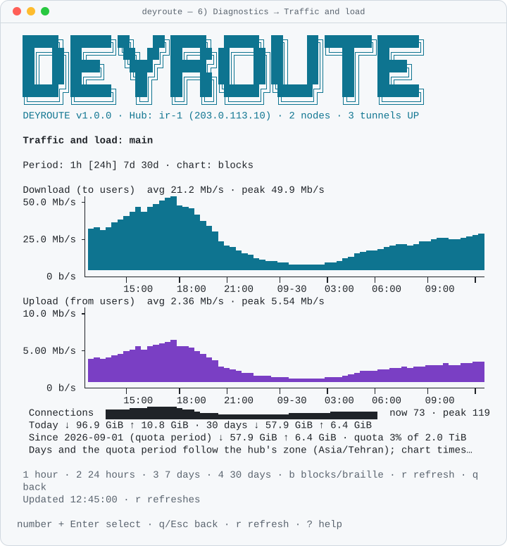
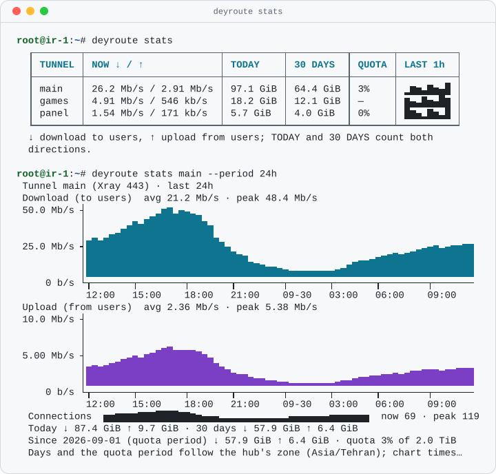

# Traffic and load

[فارسی](../fa/monitoring.md) · [Index](index.md)

The hub counts how many bytes each tunnel carries and keeps the CPU and RAM
of the hub and of every node. You see it on the dashboard, in the menu
(`6) Diagnostics` → `6) Traffic and load`, or `t` on the dashboard), in
`deyroute stats` and in `deyroute tunnel show`. Monitoring is on by default
and needs nothing to set up.

## What is counted

- **Bytes per tunnel**, on the hub's user-facing listen ports (the ports
  your users connect to). Every transport is counted the same way, the
  userspace ones and the kernel NAT ones (WireGuard / AmneziaWG), and a
  failover switch does not reset the numbers.
- **Directions are seen from the users:**
  - **↓ download** = from the hub to the users ("out");
  - **↑ upload** = from the users to the hub ("in").

  Download and upload are always shown as separate, labelled numbers or
  panels, never only by colour. Without UTF-8 (`TERM=dumb`, a non-UTF-8
  locale or `DEYROUTE_ASCII=1`) the arrows are `v` and `^`.
- **Connections**: the established TCP connections of the tunnel ports. UDP
  has no connection state, so a UDP tunnel shows `n/a` instead of 0.
- **CPU and RAM** of the hub and of each node (from the nodes' heartbeat).

The bytes are IP (L3) bytes, so they are a little more than the payload your
users see. Your provider usually bills the hub's network interface, which
also carries the tunnel leg to the node: expect the bill to be about twice
the user-side numbers.

When the hub cannot count bytes (nftables is missing, or the server is a
container without nf_tables) every byte number shows `—` and the reason
`DEY-X061`; deyroute never shows an unknown amount as `0 B`. Connection
counts and CPU/RAM keep working.

## How it is counted

deyroute adds a second nftables table, `table inet deyroute_stats`, next to
its firewall table `inet deyroute`. It only counts: every chain has
`policy accept` and no rule accepts or drops anything, so it can never block
traffic. It does not use connection tracking (conntrack is only matched for
kernel NAT rungs, which already need it), so it adds no conntrack load. The
table is rebuilt only when the set of tunnel ports changes, and it exists
even with `security.firewall_managed: false`.

```bash
nft list table inet deyroute_stats
```

To turn monitoring off, set this in `/etc/deyroute/config.yaml` and run
`deyroute config apply`; the table is removed and the numbers disappear from
the screens:

```yaml
monitoring:
  enabled: false
```

Uninstall removes the table as well.

## Where you see it

**Dashboard** (`deyroute status` and `1) Dashboard`): under TUNNELS a
TRAFFIC block shows, per tunnel, a sparkline of the last hour, the current
download and upload rate and, from 100 columns, today's volume:

```text
 TRAFFIC  last hour · ↓ download to users · ↑ upload from users
  Main 443/2053  ▂▂▃▄▅▅▆▇▇█▂▂▃▄▅▅▆▇▇█▂▂▃▄▅▅▆▇▇█  ↓ 12.3 Mb/s  ↑ 1.20 Mb/s  today ↓ 3.8 GiB ↑ 512.0 MiB
  Games UDP      ▂▂▃▄···▇▇█▂▂▃▄▅▅▆▇▇█▂▂▃▄▅▅▆▇▇█  ↓  250 kb/s  ↑ 64.0 kb/s  today ↓ 95.0 MiB ↑ 20.0 MiB
```

The block appears only when the hub counts traffic. On a short terminal it
shows the busiest tunnels and a `+N more` line, so the warnings below stay
visible.

**Traffic screen** (`6) Diagnostics` → `6) Traffic and load`, or `t` on the
dashboard): pick a tunnel, a node or the hub.

- A tunnel shows the panels **Download (to users)** and **Upload (from
  users)** with their average and peak, its connections, and its totals:
  today, the last 30 days and the current quota period.
- A node or the hub shows **CPU** and **RAM**.
- `1` `2` `3` `4` choose the last hour, 24 hours, 7 days or 30 days; `b`
  switches between block and braille charts (braille needs UTF-8); `r`
  refreshes. The last hour refreshes by itself every 2 seconds.
- A gap (the hub was stopped, the tunnel was down, a counter reset or a
  clock jump) is drawn as `·` (`?` without UTF-8), never as zero.

<p align="center">
  <picture>
    <source media="(prefers-color-scheme: dark)" srcset="../assets/screens/tui-traffic-dark.svg">
    
  </picture>
</p>

**`deyroute stats`**:

```bash
deyroute stats                          # every tunnel: rate now, today, 30 days, quota, sparkline
deyroute stats main --period 24h        # charts of one tunnel
deyroute stats node:de-1 hub --period 7d
deyroute stats main --watch --style braille
deyroute stats --period 30d --json      # the raw report for scripts
```

<p align="center">
  <picture>
    <source media="(prefers-color-scheme: dark)" srcset="../assets/screens/cli-stats-dark.svg">
    
  </picture>
</p>

A target is a tunnel id (or `tunnel:<id>`), `node:<id>` or `hub`. A tunnel
whose id is `hub` is `tunnel:hub`. A wrong period or target is `DEY-C027`
(exit code 1). `--json` prints the report described in
[`--json` output](../cli-json.md) and never a drawn chart; `--watch --json`
prints one document per refresh.

**`deyroute tunnel show <id>`** has a summary line:

```text
  Traffic:     today ↓ 3.8 GiB ↑ 512.0 MiB · 30 days ↓ 410.0 GiB ↑ 40.0 GiB · now ↓ 12.3 Mb/s ↑ 1.20 Mb/s · 12 connections
```

Rates are in bits per second (`kb/s`, `Mb/s`, `Gb/s`); volumes are in IEC
units (`KiB`, `MiB`, `GiB`, `TiB`).

## Days and time zones

"Today" starts at 00:00 in the **hub's** time zone, and so does the quota
period. The times on the charts' x axis are in the time zone of the terminal
that shows them. The Traffic screen and `deyroute stats` name the hub's zone
under the totals.

## History

| Resolution | Kept for |
| --- | --- |
| 10 seconds (in memory) | the last hour |
| 1 minute | 24 hours |
| 30 minutes | 32 days |
| one total per quota period | 13 periods |

The history is stored in `/var/lib/deyroute/state.db`. At most 64 tunnels and
64 nodes are recorded. When the database grows above 80 % of its 50 MiB
budget, the 1-minute points are kept for 6 hours instead of 24 and the hub
warns once (`DEY-X063`). Deleting a tunnel or removing a node deletes its
history.

The traffic history is **not part of backups** (a backup holds
`/etc/deyroute`, not `state.db`): a restored or moved hub starts counting
again from zero.

## Monthly quota

Give a tunnel a monthly quota in GiB (download + upload of its users):

```yaml
monitoring:
  quota_reset_day: 1        # the day (1-28) the quota period starts, hub time; default 1
tunnels:
  - id: main
    advanced:
      monthly_quota_gib: 100
```

Then run `deyroute config apply`. The QUOTA column of `deyroute stats` and
the Traffic screen show how much of it is used. At 80 % the hub records a
`traffic_quota` warning event and at 100 % an error event, once per period.
Nothing is blocked: the quota only informs you. Telegram sends these events
when the notification events include `quota` (then `deyroute config
apply`):

```yaml
hub:
  notify:
    telegram:
      events: [down, switch, failback, node_offline, quota]
```

The quota counts the user side; as explained above, the provider's bill for
the hub is usually about twice as much.

Releases before traffic monitoring do not know the `monitoring:` section or
`monthly_quota_gib`, so `deyroute update --rollback` to such a release is
refused while they are set (`DEY-S011`); remove them first.

## Problems

| You see | Meaning | What to do |
| --- | --- | --- |
| `—` and `DEY-X061` | the hub cannot count bytes | install nftables (`apt install nftables`) on a host with nf_tables, check `monitoring.enabled`, then `systemctl restart deyroute-hub` |
| `DEY-X062` | one reading failed; that interval is a gap | `nft list table inet deyroute_stats`; a missing table is rebuilt at the next reading; if it repeats run `deyroute doctor` |
| `DEY-X063` | `state.db` is above its size budget | check free space (`df -h /var/lib/deyroute`) and the number of tunnels and nodes |
| no TRAFFIC block | monitoring is off, or the hub has no sample yet (wait 10 seconds) | `deyroute stats` says why |
