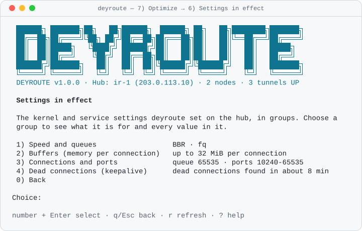
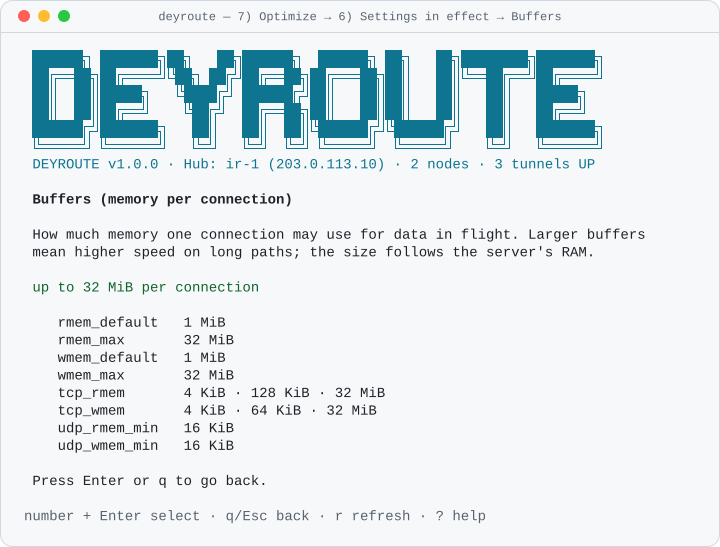

# تنظیم خودکار

<div dir="rtl">

[English](../en/tuning.md) · [فهرست](index.md)

`deyroute optimize auto` هر سرور (Hub و هر Node آنلاین) را اندازه می‌گیرد و تنظیمات کرنل و حدود سرویس‌ها را متناسب با همان سرور می‌گذارد. هیچ چیز بی‌صدا عوض نمی‌شود: هر تغییر با مقدار فعلی، مقدار جدید، زمان اثر و دلیلش فهرست می‌شود و فقط بعد از یک بار تأیید اعمال می‌شود. همه‌چیز با `deyroute optimize revert` برمی‌گردد.

در منو: `7) Optimize → 1) Automatic tuning (recommended)`. ویزارد نصب هم همین را به‌عنوان آخرین سؤال می‌پرسد (*Tune this server automatically*) و پیش از سؤال، فهرست تغییرات همین سرور را نشان می‌دهد.

صفحه‌های خود برنامه انگلیسی هستند؛ نمونه‌های زیر همان چیزی است که روی سرور می‌بینید.

## دستورها

| دستور | چه می‌کند |
| --- | --- |
| `deyroute optimize auto --dry-run` | برنامهٔ هر سرور را نشان می‌دهد و چیزی را عوض نمی‌کند |
| `deyroute optimize auto` | برنامه را نشان می‌دهد، یک بار می‌پرسد (`yes` را تایپ کنید) و اعمالش می‌کند |
| `deyroute optimize auto --yes` | همان، بدون سؤال (برای اسکریپت) |
| `deyroute optimize auto --backends` | ترنسپورت‌ها را هم به اندازهٔ هر سرور تنظیم می‌کند (ترنسپورت فعال تانل‌هایی را که نام می‌برد ری‌استارت می‌کند) |
| `deyroute optimize apply --profile auto` | همان `optimize auto --yes` |
| `deyroute optimize check` | مقادیر تنظیم‌شده را با کرنل زنده مقایسه می‌کند؛ اگر چیزی عوض شده باشد با کد ۲ (`DEY-X067`) تمام می‌شود |
| `deyroute optimize status` | پروفایل Hub و هر Node، و Nodeهایی که هنوز باید اعمالش کنند |
| `deyroute optimize revert` | همه‌چیز را به قبل از deyroute برمی‌گرداند |

بدون ترمینال و بدون `--yes`، دستور `optimize auto` برنامه و کاری را که می‌کرد چاپ می‌کند، چیزی را عوض نمی‌کند و با کد ۳ تمام می‌شود. `--json` برنامه را (با `--dry-run`) یا نتیجه را همراه مراحلش چاپ می‌کند ([مرجع JSON](../cli-json.md)).

برنامه این شکلی است:

```text
Automatic tuning plan

hub · 2.0 GiB RAM · 2 CPU · kernel 6.1.0-21-amd64 · eth0 MTU 1500 · qdisc fq_codel
  KEY                               NOW       NEW                EFFECT        WHY
  net.core.default_qdisc            fq_codel  fq                 after reboot  fq paces every flow; it applies to network interfaces created from now on …
  net.ipv4.tcp_congestion_control   cubic     bbr                now           BBR keeps throughput high on long and lossy paths (new connections)
  net.core.rmem_max                 212992    33554432           now           socket buffers up to 32 MiB, sized for 2 GiB of RAM
  net.ipv4.ip_local_reserved_ports  -         30000-31999,44433  now           keeps 30000-31999,44433 free for deyroute's listeners …
  …

node de-1 · 1.0 GiB RAM · 1 CPU · kernel 5.15.0 · container: lxc
  nothing to change
  skipped net.core.rmem_max, net.core.wmem_max, …: DEY-X064 the kernel belongs to the machine this lxc container runs on

node nl-1
  offline: it applies the plan when it reconnects

14 changes on 3 servers.
Undo any time with: deyroute optimize revert
```

ستون **EFFECT** می‌گوید هر تغییر کی اثر می‌کند: `now` (همین حالا)، `after reboot` (بعد از ری‌استارت سرور)، `next start` (دفعهٔ بعد که سرویس روشن شود؛ چیزی به خاطرش ری‌استارت نمی‌شود) یا `restarts tunnels` (فقط با `--backends`).

اجرای دوبارهٔ `optimize auto` وقتی چیزی عوض نشده، چیزی فهرست نمی‌کند. برنامه یک hash دارد؛ اگر بین نمایش فهرست و `yes` شما چیزی عوض شود (یک Node آنلاین شود یا کسی مقداری را تغییر دهد)، اعمال با `DEY-X065` رد می‌شود و فهرست جدید را می‌بینید.

## دیدن تنظیم‌های فعال

`deyroute optimize status` تنظیم‌ها را در چند گروه نشان می‌دهد؛ برای هر گروه یک خط که می‌گوید الان یعنی چه (مثلاً «BBR · fq» یا «تا 32 MiB برای هر اتصال»). همهٔ مقدارها با `--details`. در منو: `7) Optimize` → `6) Settings in effect`؛ با انتخاب هر گروه، توضیح آن گروه و همهٔ مقدارهایش باز می‌شود.

<p align="center">
  <picture>
    <source media="(prefers-color-scheme: dark)" srcset="../assets/screens/tui-settings-dark.svg">
    
  </picture>
</p>

<p align="center">
  <picture>
    <source media="(prefers-color-scheme: dark)" srcset="../assets/screens/tui-settings-group-dark.svg">
    
  </picture>
</p>


## چه چیزهایی اندازه گرفته می‌شود

فقط فایل‌های زیر `/proc` و `/sys` خوانده می‌شوند (و صف کارت شبکه از خود کرنل پرسیده می‌شود)؛ هیچ برنامه‌ای اجرا نمی‌شود:

- RAM و تعداد CPU (سهمیهٔ CPU در cgroup سرویس هم حساب می‌شود)؛
- نسخهٔ کرنل، اینکه BBR و صف `fq` در دسترس هستند یا نه، و صف، MTU و سرعت کارت شبکهٔ مسیر پیش‌فرض؛
- اینکه سرور کانتینر است یا نه (OpenVZ، LXC، Docker)؛
- جدول conntrack: بارگذاری شده یا نه، اندازه و میزان پر بودنش؛
- مقدار فعلی هر کلیدی که برنامه عوض می‌کند.

## چه چیزی عوض می‌شود و چرا امن است

پایه همان پروفایل `balanced` است (همان کلیدها و مقادیر) و یک لایهٔ محاسبه‌شده از روی اندازه‌گیری‌ها رویش می‌آید:

| مورد | مقدار | چرا امن است |
| --- | --- | --- |
| بافرهای سوکت (`rmem_max`، `wmem_max` و مقدار سوم `tcp_rmem`/`tcp_wmem`) | زیر ۲ گیگ RAM ۱۶ MiB، زیر ۴ گیگ ۳۲ MiB، از ۴ گیگ به بالا ۶۴ MiB | این‌ها سقف هستند: کرنل فقط برای اتصالی که لازم دارد بافر را بزرگ می‌کند |
| کلیدهای حد (`somaxconn`، `tcp_max_syn_backlog`، `netdev_max_backlog`، `fs.file-max`، `fs.nr_open`، سقف بافرها) | فقط بالا بردن | مقداری که روی سرور از قبل بیشتر است هرگز کم نمی‌شود؛ با عنوان «دست‌نخورده» فهرست می‌شود و revert هم به آن دست نمی‌زند |
| `tcp_slow_start_after_idle = 0` | | تانل‌ها اتصال‌های طولانی دارند؛ اتصالی که مدتی بیکار بوده دوباره از سرعت کم شروع نمی‌کند |
| `tcp_notsent_lowat = 16384` | با BBR | صف داده‌های ارسال‌نشده کوچک می‌ماند تا BBR مسیر را درست اندازه بگیرد |
| `rmem_default`/`wmem_default = 1 MiB` | وقتی پله‌های Hysteria2 یا AmneziaWG هست | ترنسپورت‌های UDP بافر پیش‌فرض را می‌خوانند |
| `fs.nr_open ≥ 1048576` | | سرویس‌ها با `LimitNOFILE=1048576` روشن می‌شوند و systemd بالاتر از `fs.nr_open` را نمی‌پذیرد |
| `ip_local_reserved_ports` | `30000-31999`، پورت کنترل (و پورت front) | اتصال‌های خروجی هیچ‌وقت پورتی را که deyroute لازم دارد نمی‌گیرند؛ رزروهای موجود می‌مانند |
| `default_qdisc = fq` | وقتی کرنل `sch_fq` دارد | بخش «صف fq بعد از ری‌استارت» را ببینید |
| `tcp_congestion_control = bbr` | وقتی کرنل BBR دارد و `tuning.bbr` روشن است | فقط اتصال‌های جدید؛ در غیر این صورت با دلیلش کنار گذاشته می‌شود |
| conntrack (پایین‌تر) | وقتی conntrack بارگذاری شده یا فایروال لازمش دارد | |

علاوه بر `/etc/sysctl.d/99-deyroute.conf` ممکن است این‌ها هم نوشته شوند:

- `/sys/module/nf_conntrack/parameters/hashsize` و `/etc/modprobe.d/deyroute.conf` (جدول hash مربوط به conntrack، همین حالا و بعد از بوت) و `/etc/modules-load.d/deyroute.conf` (ماژول `nf_conntrack` را موقع بوت بار می‌کند تا کلیدهایش اعمال شوند)؛
- حدود سرویس‌ها در فایل‌های drop-in به نام `60-deyroute-auto.conf` کنار سرویس‌های deyroute: ترنسپورت‌ها `OOMScoreAdjust=300` می‌گیرند (روی سرور کوچک، ترنسپورتی که از کنترل خارج شده اول متوقف می‌شود، نه sshd یا Hub؛ systemd و Failover دوباره روشنش می‌کنند)، همهٔ ترنسپورت‌ها روی هم سقف حافظهٔ ۷۵٪ RAM می‌گیرند (`MemoryHigh`؛ کرنل حافظه را پس می‌گیرد و چیزی به خاطرش کشته نمی‌شود) و Hub بسته به RAM مقدار `GOMEMLIMIT` می‌گیرد (۱۲۸، ۲۵۶ یا ۵۱۲ MiB). یک `daemon-reload` این‌ها را می‌خواند؛ چیزی ری‌استارت نمی‌شود و دفعهٔ بعد که سرویس روشن شود اعمال می‌شوند.

چیزهایی که **هرگز** دست نمی‌خورند: SSH، جدول‌های فایروال برنامه‌های دیگر، Docker و بقیهٔ فایل‌های `/etc/sysctl.d` (فقط خوانده می‌شوند تا جایگزین‌شدن مقادیر گزارش شود). جدول فایروال `inet deyroute` از قبل MSS را روی مسیرهای WireGuard محدود می‌کند؛ تنظیم خودکار آن را فهرست می‌کند ولی عوضش نمی‌کند.

### ترنسپورت‌ها (`--backends`)

با `--backends` هر سرور یک ردهٔ اندازهٔ ثابت می‌گیرد (`small` زیر ۱ گیگ RAM یا با یک CPU، `medium` زیر ۴ گیگ، `large` بالاتر) که در `config.yaml` ذخیره می‌شود. این رده بافرهای mux در Backhaul، استخر اتصال frp (مگر اینکه `advanced.connection_pool` تنظیم شده باشد) و پروفایل حافظهٔ Waterwall را تعیین می‌کند و MTU وایرگارد را برای کارت شبکهٔ زیر ۱۵۰۰ مناسب می‌کند. این موارد فایل‌های ترنسپورت را بازنویسی می‌کنند و **ترنسپورت فعال** تانل‌های فهرست‌شده را ری‌استارت می‌کنند (کاربران یک بار دوباره وصل می‌شوند)، برای همین بدون این گزینه هیچ‌وقت در برنامه نیستند.

## Conntrack

Connection tracking برای هر جریان یک ورودی نگه می‌دارد. اندازهٔ پیش‌فرض کرنل روی VPS با ۵۱۲ مگ تا ۱ گیگ RAM کوچک است و یک Hub شلوغ با کاربران موبایل و QUIC زیاد می‌تواند پرش کند: آن وقت کرنل `nf_conntrack: table full, dropping packet` می‌نویسد و اتصال‌های جدید وصل نمی‌شوند. برنامه این‌ها را می‌گذارد:

- `nf_conntrack_max` = ۶۴ ورودی به ازای هر MiB از RAM، بین 65536 و 1048576 (فقط بالا بردن)؛
- جدول hash به اندازهٔ یک‌چهارم آن؛
- `nf_conntrack_tcp_timeout_established = 86400` (یک روز به جای پنج روز): keepalive وایرگارد (هر ۲۵ ثانیه) جریان‌های زندهٔ تانل را باز نگه می‌دارد، پس فقط ورودی‌های مرده زودتر پاک می‌شوند. اگر خودتان مقدار دیگری گذاشته باشید دست نمی‌خورد (کنار گذاشته می‌شود).

`deyroute optimize check` جدولی را که بیش از ۸۰٪ پر است گزارش می‌کند.

## صف fq بعد از ری‌استارت

`default_qdisc = fq` روی کارت‌های شبکه‌ای اعمال می‌شود که از این به بعد ساخته می‌شوند. کارتی که الان روشن است تا بوت بعدی صف خودش را نگه می‌دارد: عوض کردنش در حال کار بسته‌ها را دور می‌ریزد، برای همین deyroute هرگز این کار را نمی‌کند. برنامه این مورد را `after reboot` نشان می‌دهد. BBR روی کرنل 4.13 و جدیدتر بدون `fq` هم کار می‌کند (خودش سرعت ارسال را تنظیم می‌کند)، پس تا آن موقع چیزی از دست نمی‌رود.

## کانتینرها

در OpenVZ، LXC یا Docker کرنل مال میزبان است: `/proc/sys` فقط‌خواندنی یا مشترک است. همهٔ موارد کرنل با `DEY-X064` کنار گذاشته می‌شوند و فقط حدود سرویس‌ها اعمال می‌شوند. اگر تنظیم کرنل را می‌خواهید، از ارائه‌دهنده سرور KVM یا اختصاصی بگیرید.

## Nodeها

`optimize auto` روی هر Node آنلاین هم برنامه می‌ریزد و اعمال می‌کند؛ Node آفلاین `pending` نشان داده می‌شود و وقتی دوباره وصل شد برنامه را اعمال می‌کند. `yes` شما اجازه برای Nodeهایی که بعداً Join می‌کنند هم هست: Hub وقتی آنلاین شدند آن‌ها را به همین شکل تنظیم می‌کند. Nodeی که نسخهٔ agentش برای تنظیم خودکار قدیمی است، `balanced` و یک هشدار می‌گیرد (با `deyroute update` به‌روزش کنید). `deyroute optimize status` پروفایل هر Node و اینکه هنوز منتظر است یا نه را نشان می‌دهد.

## وقتی کس دیگری مقداری را عوض می‌کند

`deyroute optimize check` (منوی `7) Optimize → 5) Check tuning`) هر مقداری را که deyroute گذاشته با کرنل زنده مقایسه می‌کند. هر تفاوت با عامل تغییرش فهرست می‌شود:

- فایلی که در `/etc/sysctl.d`، `/run/sysctl.d` یا `/usr/lib/sysctl.d` بعد از `99-deyroute.conf` می‌آید، یا **`/etc/sysctl.conf`** که systemd آخر از همه اعمالش می‌کند و بر همهٔ فایل‌های `sysctl.d` غلبه می‌کند؛
- در غیر این صورت نوشتن در حال کار (یک ابزار دیگر، یک اسکریپت، agent پنل).

تنظیم دیگر را بردارید یا عمداً نگهش دارید. اگر مقدار deyroute را می‌خواهید، `deyroute optimize auto` دوباره فهرستش می‌کند. Hub هم هر ۶ ساعت این بررسی را انجام می‌دهد و برای هر تفاوت جدید یک رویداد هشدار ثبت می‌کند؛ هیچ‌وقت خودش چیزی را عوض نمی‌کند. موقع بوت، deyroute فقط مقادیر تأییدشدهٔ خودش را که کرنل هنوز نداشت دوباره اعمال می‌کند (مثلاً کلیدهای conntrack که بعد از بار شدن ماژول ظاهر می‌شوند).

## برگرداندن

`deyroute optimize revert` (منوی `7) Optimize → 3) Revert`):

- هر کلید را به مقدار قبل از deyroute برمی‌گرداند — ولی فقط وقتی مقدار زنده هنوز همانی است که deyroute نوشته؛ کلیدی که از آن به بعد کسی عوضش کرده با یک هشدار دست‌نخورده می‌ماند؛
- هیچ کلید حدی را پایین‌تر از مصرف فعلی (مصرف × ۱٫۲۵) نمی‌آورد: چنین کلیدی مقدار زنده‌اش را نگه می‌دارد، از فایل conf حذف می‌شود و یک هشدار می‌گوید مقدار کمتر بعد از بوت بعدی برمی‌گردد؛
- جدول hash مربوط به conntrack را برمی‌گرداند و فایل‌های ماژول، modprobe و drop-inهای سرویس را پاک می‌کند (با یک `daemon-reload`)؛
- رده‌های اندازهٔ ترنسپورت را پاک می‌کند؛ تانل‌هایی که اثر می‌گیرند فهرست و ری‌استارت می‌شوند؛
- Nodeها را به `off` برمی‌گرداند.

بکاپ مقادیر قدیمی فقط وقتی پاک می‌شود که همه‌چیز برگشته باشد. `deyroute uninstall` هم همین کار را می‌کند.

## پروفایل‌های ثابت

پروفایل‌های ثابت برای کسانی که ترجیحشان می‌دهند هنوز هستند: `deyroute optimize apply --profile balanced|aggressive|off` (منوی `7) Optimize → 2) Apply profile`). انتخاب یکی از آن‌ها بعد از `auto` از تنظیم خودکار بیرون می‌آید: Nodeها دیگر خودکار تنظیم نمی‌شوند. تنظیم خودکار هرگز ترتیب ترنسپورت‌های شما یا ترنسپورت فعال را عوض نمی‌کند.

</div>
